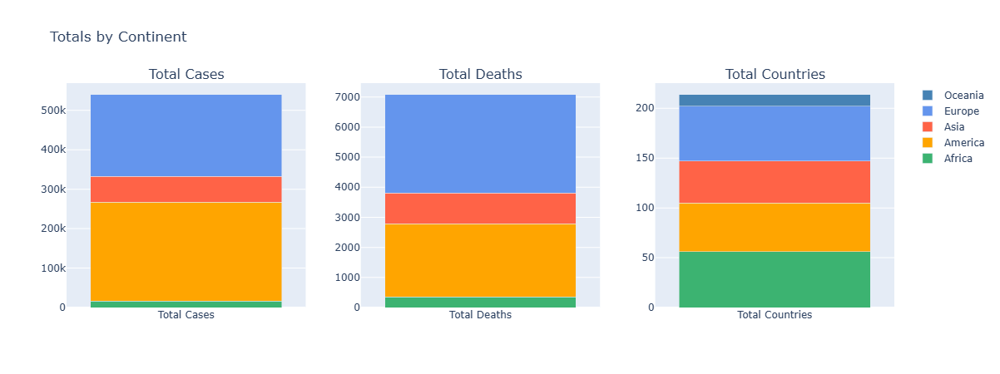
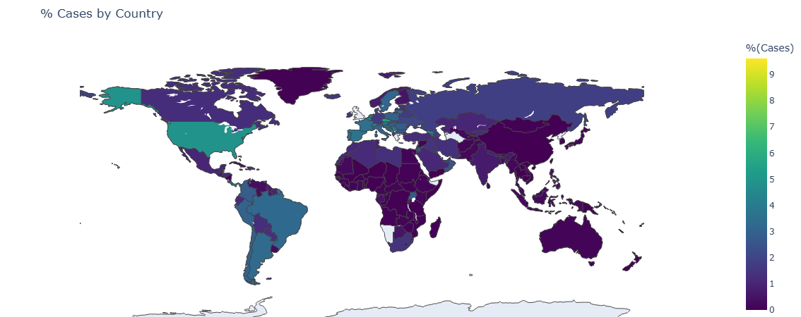
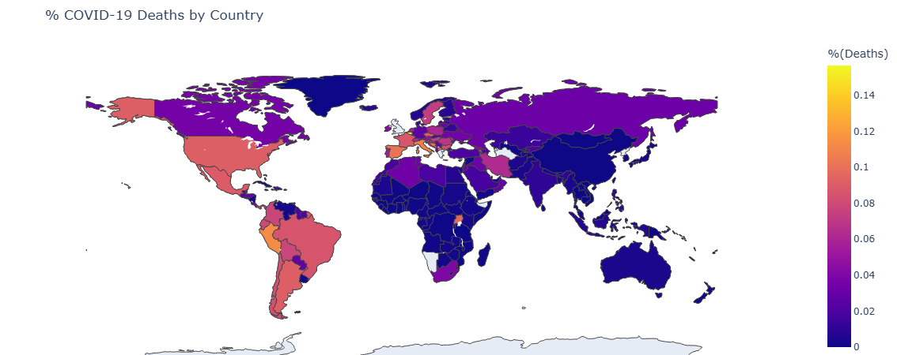
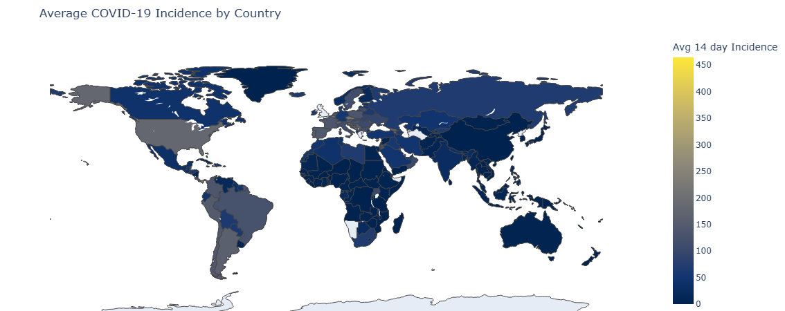
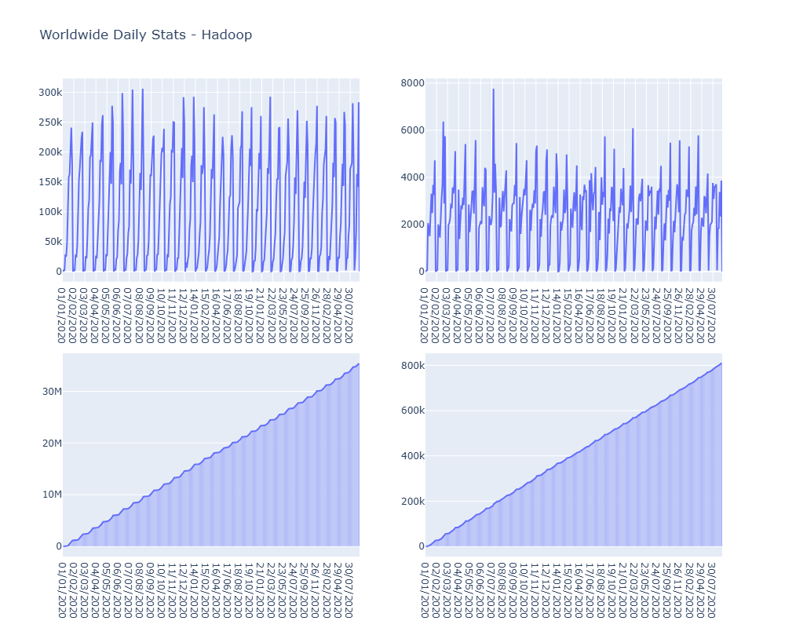
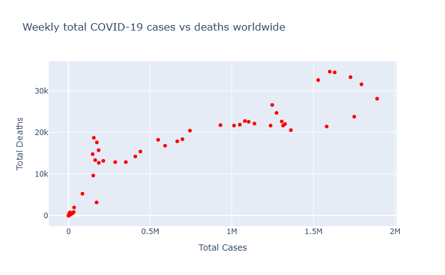
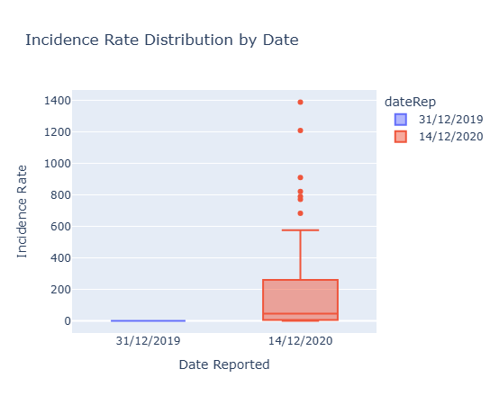

## Hadoop

### 1. setup

Creating a hadoop container using the pulled image, then moving the mapper and reducer scripts into the container

```bash
docker run -it --name bigdata_hadoop prasanthj/docker-hadoop /etc/bootstrap.sh -bash
# docker start -i bigdata_hadoop
```
```bash
docker cp code/scripts/reducers/ bigdata_hadoop:/
 docker cp code/scripts/mappers bigdata_hadoop:/
```

_now inside the container_
```bash
jps
export PATH=$PATH:$HADOOP_PREFIX/bin >> ~/.bashrc
source ~/.bashrc
hadoop version
```

### 2. data preperation

```bash
curl https://opendata.ecdc.europa.eu/covid19/casedistribution/csv/data.csv -o data/covid.csv
wc -l data/covid.csv 
# 61901 covid.csv
```
_the 1 is for the extra header file: same as the json data taken in mongodb_  

> we will check if the datasets are different later on after processing

```bash
hdfs dfs -put data/covid.csv covid.csv
mkdir output/
mkdir logs/ # -- to save logs of hadoop jobs
```

So in here will:

* create output csv files resulting from mapreduce jobs
* create logs directory to save logs of hadoop jobs for later analysis (performance comparison with mongodb)

### 3. Queries


#### 3.1 Query 1: continent stat

<!-- ```bash
# testing the mappers reducers locally first
python3 mappers/continent_stat.py < data/covid.csv | sort | python3 reducers/continent_stat.py 
``` -->

```bash
hadoop jar $HADOOP_COMMON_HOME/share/hadoop/tools/lib/hadoop-streaming-2.7.2.jar \
-D mapreduce.job.name="continent_stats" \
-files mappers/continent_stats_mapper.py,reducers/continent_stats_reducer.py \
-input covid.csv \
-output continent_stats/ > logs/continent_stats.log 2>&1
```

```bash
hdfs dfs -cat continent_stats/*  > output/continent_stats.csv
```



Similar trend as before with mongodb, Europe and North America most affected, Africa least affected, countries representation also similar

#### 3.2 Query 2: country stats

```bash
hadoop jar $HADOOP_COMMON_HOME/share/hadoop/tools/lib/hadoop-streaming-2.7.2.jar \
-D mapreduce.job.name="country_stats" \
-files mappers/country_stats_mapper.py,reducers/country_stats_reducer.py \
-input covid.csv \
-output country_stats/ > logs/country_stats.log 2>&1
```

```bash
hdfs dfs -cat country_stats/*  > output/country_stats.csv
```



The cases map show some similarity with the one obtained with mongodb, with some differences in color intensity for some countries but generally we see:  

- US and latin america highly affected
- Western Europe also with lighter colors  
- Africa less overall

These discrepancies can be due to rounding errors or differences in how the data is processed in the mapreduce jobs compared to mongodb aggregations, as these percentages are quite small.



Also same for deaths map, similar trends but some differences in color intensity for some countries, overall the same observations hold.



Same for incidence rate map.

#### 3.3 Query 3: USA daily stats

```bash
# hdfs dfs -rm -r USA_daily_stats/
hadoop jar $HADOOP_COMMON_HOME/share/hadoop/tools/lib/hadoop-streaming-2.7.2.jar \
-D mapreduce.job.name="usa_daily_stats" \
-files mappers/USA_daily_stats_mapper.py,reducers/USA_daily_stats_reducer.py  \
-mapper USA_daily_stats_mapper.py \
-reducer USA_daily_stats_reducer.py \
-input covid.csv \
-output USA_daily_stats/ > logs/USA_daily_stats.log 2>&1
```

```bash
hdfs dfs -cat USA_daily_stats3/* | awk -F '\t' '{print $2}' > output/USA_daily_stats.csv
```

#### 3.4 Query 4: worldwide daily stats

```bash
hadoop jar $HADOOP_COMMON_HOME/share/hadoop/tools/lib/hadoop-streaming-2.7.2.jar \
-D mapreduce.job.name="worldwide_daily_stats" \
-files mappers/worldwide_daily_stats_mapper.py,reducers/worldwide_daily_stats_reducer.py \
-mapper worldwide_daily_stats_mapper.py \
-reducer worldwide_daily_stats_reducer.py \
-input covid.csv \
-output worldwide_daily_stats > logs/worldwide_daily_stats.log 2>&1
``` 

```bash
hdfs dfs -cat worldwide_daily_stats/*  > output/worldwide_daily_stats.csv
```



VERY IMPORTANT observation:

As we can see the worldwide trend here shows very high fluctuations between maximal and minimal values, resembling a sinusoidal pattern - while not particuallry epidemiologically sound, this is actually due to reporting delays and weekly cycles in data collection and reporting.  
It's different from results in mongodb as the datasets taken are practically coming from different files, even if it's the same source ansd limited to a particular number of entries (also see cumulative plot to be **steadily** inccreasing with constant slope, which is extremly different from the former one)

This type of plot allow to check for such anomilies in data collection as we would be checking for daily changes in general and thus missing entries like days or countries can be directly spotted

#### 3.5 Query 5: 

```bash
hadoop jar $HADOOP_COMMON_HOME/share/hadoop/tools/lib/hadoop-streaming-2.7.2.jar \
-D mapreduce.job.name="weekly_stats" \
-files mappers/weekly_stats_mapper.py,reducers/weekly_stats_reducer.py \
-mapper weekly_stats_mapper.py \
-reducer weekly_stats_reducer.py \
-input covid.csv \
-output weekly_stats/ > logs/weekly_stats.log 2>&1
```

```bash
hdfs dfs -cat weekly_stats/*  > output/weekly_stats.csv
```



The cases vs deaths plot also shows a positive correlation, similar to mongodb, depicting important data trends.

#### 3.6 Query 6:

```bash
hadoop jar $HADOOP_COMMON_HOME/share/hadoop/tools/lib/hadoop-streaming-2.7.2.jar \
-D mapreduce.job.name="start_end_date_incidence_stats" \
-files mappers/start_end_date_incidence_stats_mapper.py,reducers/start_end_date_incidence_stats_reducer.py \
-mapper start_end_date_incidence_stats_mapper.py \
-reducer start_end_date_incidence_stats_reducer.py \
-input covid.csv \
-output start_end_date_incidence_stats/ > logs/start_end_date_incidence_stats.log 2>&1
```

```bash
hdfs dfs -cat start_end_date_incidence_stats/*  > output/start_end_date_incidence_stats.csv
```



As previously seen, some days showed little to no entries in the dataset here, leading to some discrepancies in the boxplots compared to mongodb. In fact, one boxplot is complelty null, while not really depicting reality, it solidifies the idea that there is missing data here, and thus its not very plausible to perform a stat analysis using such data
