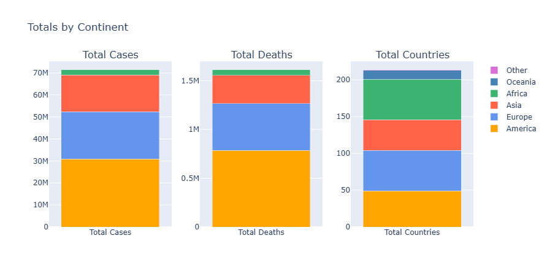
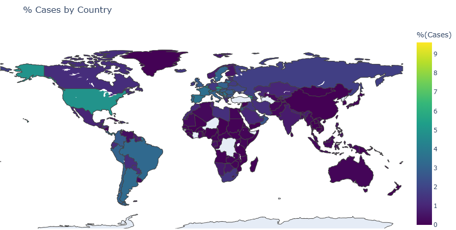
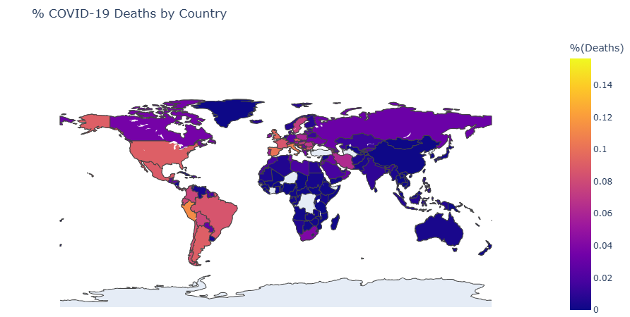
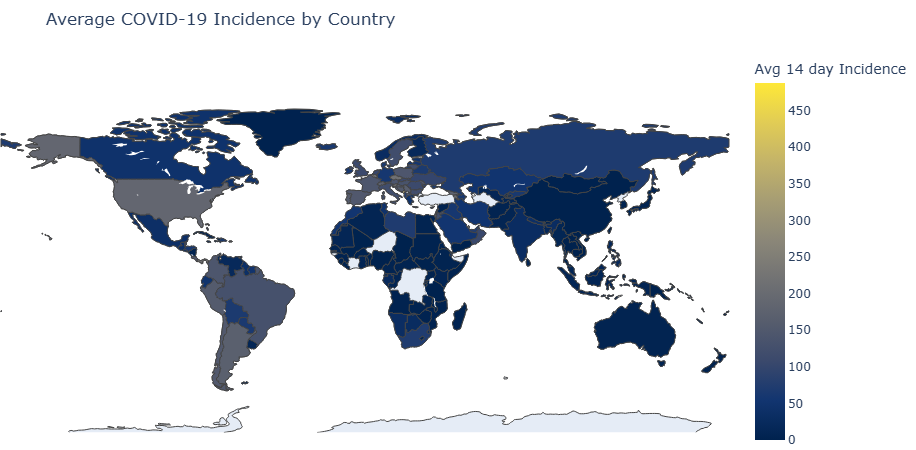
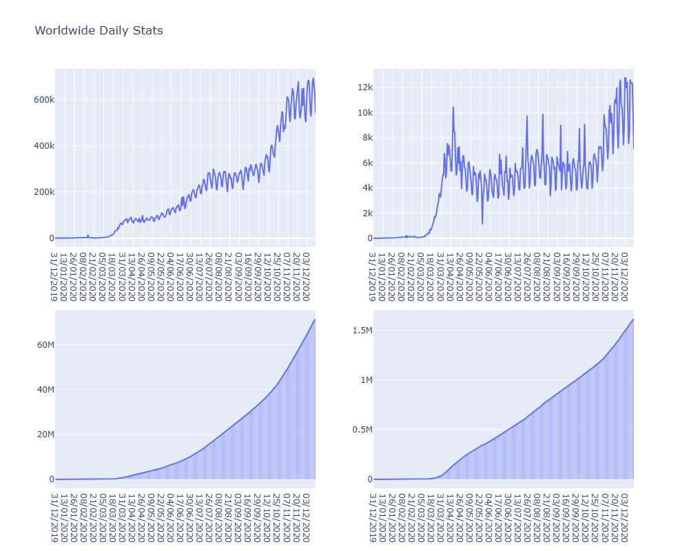
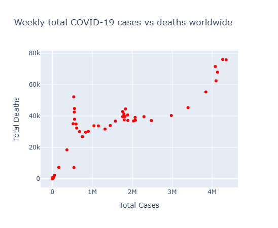
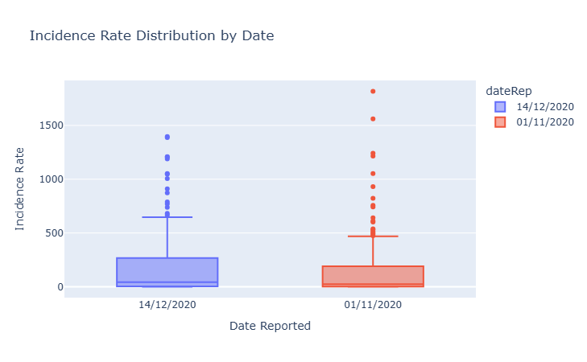

## MongoDB


> [!NOTE]  
> All mongodb commands here can be found in a javascript script in code/scripts/mongodb.js

### 1. setup
**Starting by setting up a mongodb container using the pulled image and downloading the dataset**
   
```bash
#docker pull mongo #-- pull the image if not there
docker run -d --name bigdata_mongodb -p 27017-27019:27017-27019 mongo:latest
```


### 2. data preperation 

**Importing the datasets into the mongodb container, then using `mongoimport` command**

On my local machine:
1. will download the publically available covid-19 dataset:
    ```bash
    # -- installing curl if not there
    apt-get update && apt-get install -y curl

    # -- downloading the dataset first 
    curl https://opendata.ecdc.europa.eu/covid19/casedistribution/json/data.json -o data/covid.json
    ```

2. will split the data into 2 files
    _p.s.  wrote a script to split the json into 2 files as the file is 26Mb surpassing the 16Mb limit of mongodb import (you can find it in `code/scripts/split_json.sh`)_

    ```bash
    ./code/scripts/split_json.sh data/covid.json 2 
    ls data/
    ```
    Now will have `data/covid_part_1.json` and `data/covid_part_2.json` files each less than 16Mb
3. copy the files to docker container
    ```bash
    docker cp data/covid_part_1.json bigdata_mongodb:/data/covid_part_1.json
    docker cp data/covid_part_2.json bigdata_mongodb:/data/covid_part_2.json
    ```


_entering the container now_
```bash
docker exec -it bigdata_mongodb bash

# -- importing the data into mongodb
mongoimport --db covid_db --collection worldwide_cases --file data/covid_part_1.json --jsonArray
mongoimport --db covid_db --collection worldwide_cases --file data/covid_part_2.json --jsonArray
```

<!--  -->

<!-- general data queries to explor the data we have -->

**General Data Queries**

```js
// -- count the number of documents in the collection
db.worldwide_cases.countDocuments()
// 61900

// -- find one document to see the structure
db.worldwide_cases.findOne({})
```

```js
{
  _id: ObjectId('690f33b777a56eeaf189a2dd'),
  dateRep: '03/12/2020',
  day: '03',
  month: '12',
  year: '2020',
  cases: 202,
  deaths: 19,
  countriesAndTerritories: 'Afghanistan',
  geoId: 'AF',
  countryterritoryCode: 'AFG',
  popData2019: 38041757,
  continentExp: 'Asia',
  'Cumulative_number_for_14_days_of_COVID-19_cases_per_100000': '7.53645527'
}
```
```js
// -- number of countries enlisted
db.worldwide_cases.distinct("countriesAndTerritories").length
// 214
```

We notice that we can perform soem preprocessing on the data:  

* the `Cumulative_number_for_14_days_of_COVID-19_cases_per_100000` field is a string, better to convert it into a double
* date is in `dd/mm/yyyy` format, might be better to convert it into a date object for easier querying and processing later on (step2)

```js
db.worldwide_cases.updateMany({}, 
  [{ $set: 
    { 
      "Cumulative_number_for_14_days_of_COVID-19_cases_per_100000": 
          { $convert: {
            input: "$Cumulative_number_for_14_days_of_COVID-19_cases_per_100000",
            to: "double",
            onError: null,
            onNull: null
          }
    } 
} } ]);

db.worldwide_cases.updateMany(
  {},[
    { 
      $set: { 
        date: {
          $dateFromString: { dateString: "$dateRep", format: "%d/%m/%Y" }
        }
      }}
]);
```

This helper function is used at each step to save the results of the queries into json files:

```js
// -- helper function to save a json file from a cursor
function save_json_file(cursor, filename) {
    var array_data = []
    while (cursor.hasNext()) {
        array_data.push(cursor.next())
    }
    var file_data = JSON.stringify(array_data, null, 2)
    const fs = require('fs');
    fs.writeFileSync(filename, file_data);
    print(`-- json file saved in: ${filename}`)
}
```

#### 3.1 Query 1: Continent stats

**about**: collecting metrics across continents such as total cases, total deaths, number of countries and average 14-day incidence rate  
**how?**: using mongodb aggregation framework, will first group by country to get total cases/deaths and average incidence rate per country, then group by continent to get the final stats. Aggregation for cases, deaths and number of countries is done using `$sum` operator, while average incidence rate is done using `$avg` operator  
**aim**: get a high level overview of the pandemic situation across continents, first larger scale look at the data distribution

> whats new: performing 2 consecutive group stages to get the desired result

```js
// 0) data distribution over continents
continent_stats=db.worldwide_cases.aggregate([
  {
    $group: {
      _id: "$countriesAndTerritories",
      continent: { $first: "$continentExp" },
      avg14DayIncidence: { $avg: "$Cumulative_number_for_14_days_of_COVID-19_cases_per_100000" },
      totalCases: { $sum: "$cases" },
      totalDeaths: { $sum: "$deaths" }
    }
  },
  { $group: {
      _id: "$continent",
      totalCases: { $sum: "$totalCases" },
      totalDeaths: { $sum: "$totalDeaths" },
      numberOfCountries: { $sum: 1 },
      avg14DayIncidence: { $avg: "$avg14DayIncidence" }
    }
  },
  { $project: {
      continent: "$_id",
      totalCases: 1,
      totalDeaths: 1,
      numberOfCountries: 1,
      avg14DayIncidence: 1
    }
  },
  { $sort: { totalCases: -1 } }
])
```

> [!NOTE] after each step we run:
```js
// -- performance analysis
var continent_stats_performance=db.worldwide_cases.aggregate([
  {
    $group: {
      _id: "$countriesAndTerritories",
      continent: { $first: "$continentExp" },
      avg14DayIncidence: { $avg: "$Cumulative_number_for_14_days_of_COVID-19_cases_per_100000" },
      totalCases: { $sum: "$cases" },
      totalDeaths: { $sum: "$deaths" }
    }
  },
  { $group: {
      _id: "$continent",
      totalCases: { $sum: "$totalCases" },
      totalDeaths: { $sum: "$totalDeaths" },
      numberOfCountries: { $sum: 1 },
      avg14DayIncidence: { $avg: "$avg14DayIncidence" }
    }
  },
  { $project: {
      continent: "$_id",
      totalCases: 1,
      totalDeaths: 1,
      numberOfCountries: 1,
      avg14DayIncidence: 1
    }
  },

  { $sort: { totalCases: -1 } }
]).explain("executionStats")
var cursorStage = continent_stats_performance.stages[0]['$cursor'].executionStats;

var queryStatsDoc = {
    query_name: "continent_stats",  
    executionTimeMillis: cursorStage.executionTimeMillis,
    totalDocsExamined: cursorStage.totalDocsExamined,
    nReturned: cursorStage.nReturned,
    timestamp: new Date() 
};

db.query_performance.insertOne(queryStatsDoc);
db.query_performance.find();
```

This allows us to log the performance of each query into a separate collection for later analysis and comparison with hadoop. At the end of all queries, we will have a `query_performance_stats` collection containing the execution time and number of documents examined for each query (you can find it in `output/mongodb/query_performance_stats.json`)

The result will be a set of documents having these fields:  

- `_id`: continent name
- `totalCases`: total number of cases in the continent
- `totalDeaths`: total number of deaths in the continent
- `numberOfCountries`: number of countries in the continent
- `avg14DayIncidence`: average 14-day incidence rate across countries in the continent




The **stacked bar plot** above shows the distribution of total cases and total deaths accross continents, we can see that Europe and North America are the most affected continents in terms of total cases and deaths, followed by Asia and South America. Africa is the least affected continent, even though it has a large number of countries. This might be an indicator of underreporting or lack of testing in Africa compared to other continents, or it could be due to other factors such as demographics, healthcare infrastructure, or even the fact that the pandemic reached Africa later than other continents.

#### 3.2 Query 2: Countries stats

**about**: collecting metrics per country such as total cases, total deaths, population and percentages of cases and deaths relative to population  
**how?**: using mongodb aggregation, will group by country to get total cases/deaths and population, then calculate percentages using `$addFields` stage  
**aim**: get a detailed overview of the pandemic situation per country

> whats new: performing normalization of cases and deaths by population size getting use of 2 fields to create a 3rd one, good to make them comparable accross countries (especially for heatmap viz)

```js
// 1) map per country
country_stats = db.worldwide_cases.aggregate([
  {
    $group: {
      _id: "$countriesAndTerritories",
      geoId: { $first: "$geoId" },
      totalCases: { $sum: "$cases" },
      totalDeaths: { $sum: "$deaths" },
      popData2019: { $first: { $toInt: "$popData2019" }},
      avg14DayIncidence: { $avg: "$Cumulative_number_for_14_days_of_COVID-19_cases_per_100000"
    }
    }
  },
  {
    $addFields: {
      percTotalCases: { $multiply: [ { $divide: ["$totalCases", "$popData2019"] }, 100 ] },
      percTotalDeaths: { $multiply: [ { $divide: ["$totalDeaths", "$popData2019"] }, 100 ] },
    }
  }
])
```

Result:

- `_id`: country name
- `geoId`: country geo id
- `totalCases`: total number of cases in the country
- `totalDeaths`: total number of deaths in the country
- `popData2019`: country population in 2019
- `percTotalCases`: percentage of total cases relative to population
- `percTotalDeaths`: percentage of total deaths relative to population
- `avg14DayIncidence`: average 14-day incidence rate in the country







_Here used the pycountry library in python to convert country names to map geoId to their corresponding 3-letter country codes (for plotly map visualization)_
  

#### 3.3 Query 3: USA daily stats


**about**: collecting daily total cases and deaths for the USA, along with cumulative cases and deaths over time
**how?**: using mongodb aggregation, will first filter for USA records, then group by date to get total cases/deaths per day, finally use `$setWindowFields` stage to calculate cumulative cases/deaths over time
**aim**: get a time series of the pandemic situation in the USA, one of the most affected countries

> whats new: using `$setWindowFields` stage to calculate cumulative sums over time, useful for time series analysis. Also needing to match first before grouping (only usa)

```js
db.worldwide_cases.find({ geoId: "US" }).limit(1)
country_daily_stats=db.worldwide_cases.aggregate([
  {
    $match: { geoId: "US" }
  },
  {
    $group: {
      _id: "$dateRep",
      year: { $first: { $toInt: "$year" } },
      month: { $first: { $toInt: "$month" } },
      day: { $first: { $toInt: "$day" } },
      totalCases: { $sum: "$cases" },
      totalDeaths: { $sum: "$deaths" }
    }
  },
  {
    $sort: { year: 1, month: 1, day: 1 }
  },
  {
    $setWindowFields: {
      sortBy: { year: 1, month: 1, day: 1 },
      output: {
        cumulativeCases: {
          $sum: "$totalCases",
          window: { documents: ["unbounded", "current"] }
        },
        cumulativeDeaths: {
          $sum: "$totalDeaths",
          window: { documents: ["unbounded", "current"] }
        }
      }
    }
  },  
])
```

<!-- 
 docker start -i a5c4e6e4ce25
hdfs dfs -cat covid.csv | ../mappers/country_stats.py | sort | ../reducers/country_stats.py 

:/exercises# head -n 1 ../covid.csv 
dateRep,day,month,year,cases,deaths,countriesAndTerritories,geoId,countryterritoryCode,popData2019,continentExp,Cumulative_number_for_14_days_of_COVID-19_cases_per_100000
root@a5c4e6e4ce25:/exercises# hadoop jar $HADOOP_COMMON_HOME/share/hadoop/tools/lib/hadoop-streaming-2.7.2.jar -files  ../mappers/country_stats.py,../reducers/country_stats.py -mapper country_stats.py -reducer country_stats.py   -input covid.csv   -output t14

s# hadoop jar $HADOOP_COMMON_HOME/share/hadoop/tools/lib/hadoop-streaming-2.7.2.jar   -files ex4/mapper.py,ex4/reducer.py   -mapper mapper.py   -reducer reducer.py   -input covid.csv   -output t11
 -->

result: 

- `_id`: date (day)
- `year`: year
- `month`: month
- `day`: day
- `totalCases`: total number of cases in the USA on that day
- `totalDeaths`: total number of deaths in the USA on that day
- `cumulativeCases`: cumulative number of cases in the USA up to that day
- `cumulativeDeaths`: cumulative number of deaths in the USA up to that day


_p.s., could not put both cases and deaths in the same plot as they have very different scales, so had to split them into 2 plots each_

#### 3.4 Query 4: worldwide daily stats

**about**: collecting daily total cases and deaths worldwide, along with cumulative cases and deaths over time  
**how?**: using mongodb aggregation, will group by date to get total cases/deaths per day, then use `$setWindowFields` stage to calculate cumulative cases/deaths over time   
**aim**: get a time series of the pandemic situation worldwide, to see the overall trend of the pandemic over time, good for first glance analysis


```js

// 3) total cases/deaths per day worldwide (can group by date)
worldwide_daily_stats=db.worldwide_cases.aggregate([
  {
    $group: {
      _id: "$dateRep",
      year: { $first: { $toInt: "$year" } },
      month: { $first: { $toInt: "$month" } },
      day: { $first: { $toInt: "$day" } },
      totalCases: { $sum: "$cases" },
      totalDeaths: { $sum: "$deaths" }
    }
  },
  {
    $sort: { year: 1, month: 1, day: 1 }
  },
  {
    $setWindowFields: {
      sortBy: { year: 1, month: 1, day: 1 },
      output: {
        cumulativeCases: {
          $sum: "$totalCases",
          window: { documents: ["unbounded", "current"] }
        },
        cumulativeDeaths: {
          $sum: "$totalDeaths",
          window: { documents: ["unbounded", "current"] }
        }}
  }
  }
])
```

result:

- `_id`: date (day)
- `year`: year
- `month`: month
- `day`: day
- `totalCases`: total number of cases worldwide on that day
- `totalDeaths`: total number of deaths worldwide on that day
- `cumulativeCases`: cumulative number of cases worldwide up to that day
- `cumulativeDeaths`: cumulative number of deaths worldwide up to that day




The time series plots above show the daily and cumulative cases and deaths worldwide over time. We can see that there are several waves of cases and deaths, with peaks occurring at different times, as it was at the start of the pandamic, the trend shows an increase glovally in cases and deaths, this is pronouced in the cumulative plost, where the derivative (slope) of the curve is itself increasing  with time.

#### 3.5 Query 5: cases/death weekly analysis

**about**: tracking weekly total cases and deaths worldwide, along with average 14-day incidence rate and correlation estimate between cases and deaths  
**how?**: using mongodb aggregation, will group by ISO week and year to get weekly total cases/deaths, average incidence rate, and correlation estimate using the formula: corr(cases, deaths) = E[cases*deaths] / (E[cases] * E[deaths])  
**aim**: get a weekly overview of the pandemic situation worldwide, also, what is interesting is something called *case fatality analysis* which aims to find correlation between the number of cases and the number of deaths, this can help in predicting the number of deaths based on the number of cases, useful for health authorities to plan resources accordingly

> whats new: grouping by ISO week and year using `$isoWeek` and `$isoWeekYear` operators, also calculating correlation estimate using aggregation operators and some integration of complex formulae (was a bit hard to manage!)

```js
// 4) cases/death correlation analysis
weekly_stats=db.worldwide_cases.aggregate([
  {
    $group: {
      _id: {
        year: { $isoWeekYear: "$date" },
        week: { $isoWeek: "$date" }
      },
      weeklyCases: { $sum: "$cases" },
      weeklyDeaths: { $sum: "$deaths" },
      weekly14DayIncidence: { $avg: "$Cumulative_number_for_14_days_of_COVID-19_cases_per_100000" },
      corr: { $avg: { $multiply: ["$cases", "$deaths"] }  }
    }
  },
  {
    $project: {
      year: "$_id.year",
      week: "$_id.week",
      weeklyCases: 1,
      weeklyDeaths: 1,
      weekly14DayIncidence: 1,
      correlationEstimate: {
        $cond: [
          { $eq: [{ $multiply: ["$weeklyCases", "$weeklyDeaths"] }, 0] },
          null,
          { $divide: ["$corr", { $multiply: ["$weeklyCases", "$weeklyDeaths"] }] }
        ]
      },
      _id: 0
    }
  },
  { $sort: { year: 1, week: 1 } }
])
```

result:

- `year`: ISO week year
- `week`: ISO week number
- `weeklyCases`: total number of cases worldwide in that week
- `weeklyDeaths`: total number of deaths worldwide in that week
- `weekly14DayIncidence`: average 14-day incidence rate worldwide in that week
- `correlationEstimate`: estimate of correlation between cases and deaths in that week



This is a common analysis done in epidemiology to understand the relationship between the number of cases and the number of deaths. A high correlation estimate indicates that there is a strong relationship between the two variables, meaning that as the number of cases increases, the number of deaths also tends to increase (can be useful for predicting the number of deaths based on the number of cases, which can help health authorities plan resources accordingly)

#### 3.6 Query 6: collect the 14-day incidence rate worldwide per day for these 2 dates, group by country

**about**: collecting the 14-day incidence rate worldwide per day for the earliest and latest dates in the dataset, grouped by country  
**how?**: using mongodb queries to find the earliest and latest dates, then colelcting the incidence rates for those dates across all entries (one entry per country in a day actually)  
**aim**: get a snapshot of the incidence rates at the start and end of the dataset, useful for comparing how the situation has evolved over time across countries. It's actually interesting if one wants to test significance of change between 2 dates, while this might not be ideal in this dataset (doesnt span over a long period of time), the idea od performing statistical analysis still holds (boxplots and comparisons)

```js
// 5) collect the 14-day incidence rate worldwide per day for these 2 dates, group by country
earliest_date=db.worldwide_cases.find().sort({ date: 1 }).limit(1).next()
latest_date=db.worldwide_cases.find().sort({ date: -1 }).limit(1).next()

start_end_date_incidence_stats=db.worldwide_cases.find(
  { dateRep: { $in: [ earliest_date.dateRep, latest_date.dateRep ] } },
  { countriesAndTerritories: 1, geoId: 1, dateRep: 1,
    "Cumulative_number_for_14_days_of_COVID-19_cases_per_100000": 1,
     _id: 0 
  }
)
```

result:

- `countriesAndTerritories`: country name
- `geoId`: country geo id
- `dateRep`: date (day)
- `Cumulative_number_for_14_days_of_COVID-19_cases_per_100000`: 14-day incidence rate for that country on that date



This can be useful to compare between 2 timepoints, boxplots will relveal distribution, based on which would be a statistical test to compare the 2 distributions (t-test, mann-whitney, etc.)