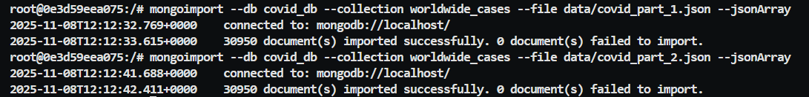

# MongoDB

> [!NOTE]  
> All mongodb commands here can be found in a javascript script in code/scripts/mongodb.js

## 1. setup
**Starting by setting up a mongodb container using the pulled image and downloading the dataset**
   
```bash
#docker pull mongo #-- pull the image if not there
docker run -d --name bigdata_mongodb -p 27017-27019:27017-27019 mongo:latest
```


## 2. data preperation 

**Importing the datasets into the mongodb container, then using `mongoimport` command**

On my local machine:
1. will download the publically available covid-19 dataset:
    ```bash
    # -- installing curl if not there
    apt-get update && apt-get install -y curl

    # -- downloading the dataset first 
    curl https://opendata.ecdc.europa.eu/covid19/casedistribution/json/data.json -o data/covid.json
    ```

2. will split the data into 2 files
    _p.s.  wrote a script to split the json into 2 files as the file is 26Mb surpassing the 16Mb limit of mongodb import (you can find it in `code/scripts/split_json.sh`)_

    ```bash
    ./code/scripts/split_json.sh data/covid.json 2 
    ls data/
    ```
    Now will have `data/covid_part_1.json` and `data/covid_part_2.json` files each less than 16Mb
3. copy the files to docker container
    ```bash
    docker cp data/covid_part_1.json bigdata_mongodb:/data/covid_part_1.json
    docker cp data/covid_part_2.json bigdata_mongodb:/data/covid_part_2.json
    ```


_entering the container now_
```bash
docker exec -it bigdata_mongodb bash

# -- importing the data into mongodb
mongoimport --db covid_db --collection worldwide_cases --file data/covid_part_1.json --jsonArray
mongoimport --db covid_db --collection worldwide_cases --file data/covid_part_2.json --jsonArray
```




## 3. Querying!


_entering mongo shell now_
```bash
mongosh
use covid_db
show collections
```

<!--  -->

<!-- general data queries to explor the data we have -->

### 3.1 General Data Queries

```js
// -- count the number of documents in the collection
db.worldwide_cases.countDocuments()
// 61900

// -- find one document to see the structure
db.worldwide_cases.findOne({})
/*
{
  _id: ObjectId('690f33b777a56eeaf189a2dd'),
  dateRep: '03/12/2020',
  day: '03',
  month: '12',
  year: '2020',
  cases: 202,
  deaths: 19,
  countriesAndTerritories: 'Afghanistan',
  geoId: 'AF',
  countryterritoryCode: 'AFG',
  popData2019: 38041757,
  continentExp: 'Asia',
  'Cumulative_number_for_14_days_of_COVID-19_cases_per_100000': '7.53645527'
}
*/

// -- number of countries enlisted
db.worldwide_cases.distinct("countriesAndTerritories").length
// 214

```

### 3.2 Specific Data Queries

* Total per country


```js

// -- total cases and total deaths in each country
country_total_stats=db.worldwide_cases.aggregate([
    { $group: { _id: "$countriesAndTerritories", totalCases: { $sum: "$cases" }, totalDeaths: { $sum: "$deaths" } } }
])
```